# 🤖 X AutoBot

**Grok 4.1-fueled dual-agent predator: 90% cynical dev humor laced with viral X trend venom, 10% autonomous SaaS deal dissection. Posts only what slays—self-reviewed, macOS-persistent, dashboarded for total dominion.**

This isn't your grandma's tweet scheduler. X AutoBot wields xAI's Grok 4.1 API in a Creator-Reviewer deathmatch: scouts X trends for hooks, forges posts mimicking 210jokes' lowercase snark, researches SaaS value props with surgical precision (Opener → Value → Hook → Link), scores ruthlessly for virality/relatability, and deploys only 8/10+ killers. Random sleeps mimic humans; crashes? It resurrects.

Zero humans in the loop. Pure autonomy.

## 🧠 Dual-Agent Annihilation Loop

```mermaid
graph TD
    Start((Cycle Ignition)) --> TrendScan[Viral Trend Sense<br/>X API Trends]
    TrendScan --> Decide{90% Joke<br/>10% Deal?}
    Decide -- "Joke" --> CreatorJ[Joke Creator<br/>Few-Shot 210jokes + Trends]
    Decide -- "Deal" --> CreatorD[Deal Creator<br/>CSV Pull + Value Prop Research]
    
    CreatorJ --> Draft[Draft Forge]
    CreatorD --> Draft
    
    Draft --> Reviewer[<b>Reviewer Agent</b><br/>Grok 4.1 Scores: Wit/Viral/Chars<br/>0-10 Threshold]
    
    Reviewer -- "<8 → Retry ≤3x" --> RetryLoop{Retry?}
    RetryLoop -- "Yes" --> Draft
    RetryLoop -- "No" --> FailLog[Fail Log → JSON]
    
    Reviewer -- "≥8 → Deploy" --> XBlast[X V2 API Post]
    XBlast --> SuccessLog[Success JSON + History]
    
    SuccessLog --> Sleep[Human Mimic Sleep<br/>25m–2h Uniform Random]
    FailLog --> Sleep
    Sleep --> Start
```



**Technical Edge**: Creator leverages few-shot prompting from `210jokes` DB + real-time X trends for context-aware cynicism. Deals auto-parse `Final Sales List.csv` (Col L: Product, Col O: Affiliate). Reviewer enforces brand voice, 280-char limits, viral coefficients.

## ⚡ Battle-Hardened Features
- **Trend-Predatory Creator**: Fuses X trends with 210jokes corpus for hyper-relevant, lowercase dev barbs that trendjack virality.
- **SaaS Sniper**: Hunts deals via CSV, Grok-dissects value props into addictive *Opener → Value → Hook → Link* structures. Affiliate-ready.
- **Merciless Reviewer**: Independent Grok 4.1 instance rates drafts on relatability (40%), viral spark (40%), tech-fit (20%). No mercy below 8.
- **Human Evasion**: Uniform random delays (25m–2h); idempotent posting guards duplicates.
- **macOS Daemon**: Launchd plist auto-resurrects on boot/crash. Silent, bulletproof.
- **Streamlit War Room**: Real-time logs, post history, next-strike countdown. Zero bloat.

## 🚀 Deployment Arsenal

### Prerequisites
Python 3.10+, virtualenv ritual:
```bash
python3 -m venv .venv
source .venv/bin/activate  # macOS: source .venv/bin/activate
pip install -r requirements.txt
```

Populate `.env`:
```
XAI_API_KEY=your_grok_key
X_BEARER_TOKEN=your_x_v2_bearer
X_API_KEY=...
X_API_SECRET=...
```

### Ignite the Beast
```bash
nohup ./.venv/bin/python main_bot.py &  # Daemonize
```

### Command Center
```bash
./.venv/bin/streamlit run dashboard.py  # http://localhost:8501
```

## ☁️ Cloud Deployment (24/7 Run)

To run the bot 24/7 without your laptop needing to be on, deploy it to a Cloud VPS (e.g., [Render](https://render.com), [Fly.io](https://fly.io), or [DigitalOcean](https://digitalocean.com)).

### Using Docker
1. **Build & Run Locally**:
   ```bash
   docker-compose up --build -d
   ```
2. **Cloud Upload**:
   - Push this repo to GitHub.
   - Connect your repo to **Render** or **Railway**.
   - Set your `.env` variables in the cloud provider's dashboard.
   - The `Dockerfile` will handle the rest.

## ♾️ macOS Persistence (Local only)
Launchd integration for reboot-proof operation:
```bash
cp com.mazo.xautobot.plist ~/Library/LaunchAgents/
launchctl load ~/Library/LaunchAgents/com.mazo.xautobot.plist
```
**Halt**: `launchctl unload ~/Library/LaunchAgents/com.mazo.xautobot.plist`

## 🗂️ Core Payload
- `main_bot.py`: Orchestrator/scheduler core.
- `agents.py`: CreatorAgent/ReviewerAgent (Grok 4.1 prompts).
- `content_manager.py`: CSV/jokes loader/parser.
- `xai_wrapper.py`: Grok 4.1 API shield.
- `x_handler.py`: X V2 API blaster (trends/posts).
- `bot_activity.json`: Live audit trail.
- `posted_history.json`: Victory archive.
- `Final Sales List.csv`: Deal munitions.
- `210jokes`: Cynicism database.

## 📈 Intelligence Dashboard
Streamlit renders:
- **Live Feed**: Generations, scores, rejections.
- **Kill List**: Posted tweets + timestamps/links.
- **Doomsday Clock**: ETA to next post.

Scale. Dominate. Let the feeds burn.